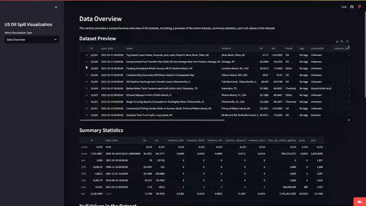

**## Update: Added slider to select the range of the year.**


# Interactive Incident Impact Analysis

This project creates an interactive visualization of oil spill incidents using PyDeck. Inspired by the need for job-ready projects and the compelling map-based storytelling by Jonny Harris, this project uses a dataset from [Kaggle](https://www.kaggle.com/datasets/kkhandekar/oil-spills-off-us-coastal-waters/data).

## Project Overview

The project explores and visualizes oil spill incidents using PyDeck for map-based visualizations and Streamlit for interactive web applications. It covers data loading, cleaning, exploratory data analysis (EDA), and creating various visualizations including scatter plots, heatmaps, impact analysis, threat-specific analysis, and time-based animations.

## Data Collection

The dataset comprises oil spill incidents off US coastal waters where NOAA's Office of Response and Restoration (OR&R) provided scientific support for the spill response. The dataset includes features such as incident name, location, latitude, longitude, threat type, commodity spilled, and various response measures.

## Data Processing

### Data Cleaning
- Dropped rows with missing latitude or longitude.
- Converted `open_date` to datetime format.
- Filled missing values in `threat` with 'Unknown'.
- Filled missing values in other columns with appropriate placeholders.

### Feature Engineering
- Standardized the `max_ptl_release_gallons` using `StandardScaler`. # the only sklearn package used

### Exploratory Data Analysis (EDA)
- Analyzed the distribution of `max_ptl_release_gallons`.
- Visualized the count of incidents by threat type and year.

## Visualizations

### PyDeck Visualizations
1. **Scatter Plot**: Visualizes all incidents on a map.
2. **Heatmap**: Shows the density of incidents based on `max_ptl_release_gallons`.
3. **Impact Analysis**: Highlights incidents based on the standardized potential release in gallons.
4. **Threat-Specific Analysis**: Differentiates incidents by threat type using color coding.

## Project Structure
- `dataset/`: Contains the dataset used in the project.
  - `incidents.csv`: Dataset of oil spill incidents.
- `jupyter_notebook/`: Contains Jupyter Notebooks for data analysis and visualization.
  - `us_oil_spill.ipynb`: Notebook with analysis and visualizations.
  - `us_oil_spill.html`: HTML export of the Jupyter Notebook.
- `streamlit/`: Contains the Streamlit web application.
  - `app.py`: Streamlit app script.
  - `streamlit_oil_spill.ipynb`: Notebook associated with the Streamlit app.
- `us_oil_spill_files/`: Contains additional files for visualizations.
  - Various PNG and HTML files used for visualizations.

## Installation
To install the required packages, install the dependencies listed in `requirements.txt`:

```sh
# Install the required packages
pip install -r requirements.txt
```

### requirements.txt
```text
pandas
pydeck
matplotlib
seaborn
scikit-learn
```

## Usage

### Jupyter Notebooks
To run the Jupyter Notebooks, navigate to the `jupyter_notebook` directory and start Jupyter Lab or Notebook:

```sh
jupyter lab
# or
jupyter notebook
#or 
google colab with the second file
```

Open `us_oil_spill.ipynb` to explore the analysis and visualizations.

### Streamlit App
To run the Streamlit app, navigate to the `streamlit` directory and run the Streamlit command:

```sh
streamlit run app.py
```

This will start a local server, and you can view the app in your web browser.

## Data
The dataset used in this project (`incidents.csv`) contains information about oil spill incidents in the US. The data includes details such as location, date, impact, and cause of the incidents.

## Visualizations
The project includes various visualizations to explore the oil spill incidents:

- **Interactive Maps (PyDeck)**: Visualize the geographic distribution of incidents.
- **Heatmaps and Statistical Graphs (Matplotlib & Seaborn)**: Highlight areas with a high concentration of incidents and show statistical data.

## Contributing
Contributions are welcome. Please fork the repository, make your changes, and submit a pull request. For major changes, open an issue to discuss what you would like to change.

## References

- [PyDeck Example on Kaggle](https://www.kaggle.com/code/jeongbinpark/visualization-3d-map-using-pydeck)
- [Kaggle Dataset](https://www.kaggle.com/datasets/kkhandekar/oil-spills-off-us-coastal-waters/data)

## [Streamlit App](https://chris-dsilva-us-oil-spill-visualization.streamlit.app/)





*The HTML files are interactive plots generated from the notebook.*

